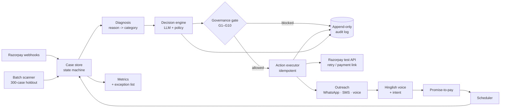

# वापसी · Wapsi

> **Revenue Recovery Agent** — finds money that's slipping away, works out why,
> and wins it back. Every money action explainable, bounded, gated, and logged.

Built for the **Razorpay AI Buildathon · Track 3 (AI Revenue Recovery)**.

---

## The problem

Revenue doesn't leave a business in one clean event — it leaks. A UPI AutoPay
renewal declines. A cart is abandoned at the payment screen. A customer says
"agle hafte kar dunga" and nobody follows up.

In India this is acute. UPI AutoPay debit failures run ~8–15% normally and
spiked to 55–90% across banks in Aug 2025, mostly from insufficient balance and
mandate issues. Most of those customers never chose to leave — that's
*involuntary churn*, and it's recoverable. Yet email-only dunning recovers under
10%, while WhatsApp plus a UPI link recovers roughly 3× more.

The gap between money lost and money recoverable — with the right timing, in the
right language — is what वापसी closes.

## What it does

**Two sensors → one brain → two layers → one ledger.**

- **Recurring-debit recovery** — catches failed subscription/AutoPay debits,
  diagnoses the reason, and retries *intelligently*: insufficient funds waits for
  salary day, bank downtime backs off, a revoked mandate is never silently
  charged.
- **Checkout drop-off recovery** — nudges abandoned checkouts, then a bounded
  offer only if the nudge fails.
- **Hinglish voice concierge** — customers reply by voice note ("abhi paise
  nahi, agle hafte kar dunga") and the agent understands; reminders go out in
  Hinglish voice too.
- **Promise-to-pay tracking** — logs the promise, pauses other outreach,
  schedules the retry for that date, follows through, and reports kept-promise
  rate.

## Why it's safe

Every money action passes a **governance gate** before it fires — bounded by max
attempts, discount caps, exposure limits, a 24h contact gap, grace periods, and
an RBI-style pre-debit notice. Anything it can't evaluate, it blocks.

Every decision is written to an **append-only audit log** with plain-language
reasoning, enforced at the database level. You can read one case top to bottom
and understand every rupee that moved, and why.

## Architecture



## Tech stack

| Layer | Choice |
| --- | --- |
| Backend | Python 3.11 · FastAPI · APScheduler |
| Database | Supabase (Postgres) — Realtime + append-only audit trigger |
| Payments | Razorpay test-mode APIs + webhooks |
| Agent brain | Gemini Flash (free tier) |
| Voice | Gemini (inbound Hinglish) · ElevenLabs (outbound) |
| Dashboard | React · Vite · Tailwind · Recharts |

## Quickstart

Full walkthrough in [`SETUP.md`](SETUP.md). Short version:

```bash
python3 -m venv .venv && source .venv/bin/activate
pip install -r requirements.txt
cp .env.example .env                        # add Razorpay + Supabase + Gemini keys

# run supabase/migrations/001_initial_schema.sql in Supabase → SQL Editor
python -m app.detection.synthetic_data      # dev (100) + holdout (300) sets

uvicorn app.main:app --reload --port 8000   # backend
cd dashboard && npm install && npm run dev  # dashboard → :5173
```

## Results

Measured on a **300-case held-out batch** never used for tuning.
_Populated after the final run:_

| Metric | Naive baseline | वापसी |
| --- | --- | --- |
| Recovery rate (count) | — | — |
| Recovery rate (value) | — | — |
| **Lift over baseline** | — | **—** |
| Ceiling capture | — | — |
| Kept-promise rate | — | — |
| Double-charges | — | **0** |

Plus a full exception list: every unrecovered case, grouped by reason, with why.

## What's real vs simulated

**Real:**
- Razorpay test-mode API calls — real HTTP requests, real payment link IDs,
  real webhook payloads and signatures. Test mode means no money moves; it does
  not mean mocked.
- Postgres constraints doing real work — a UNIQUE idempotency key prevents
  double-charges at the database level; an append-only trigger rejects any
  attempt to alter the audit log.
- Hinglish transcription on real recorded audio.
- All decision logic: salary-day timing, reason-aware retries, governance gates.

**Simulated:**
- The population of 400 at-risk cases. No merchant has 300 real failed debits
  available for a two-week build, and the track asks for measured recovery
  across a batch. Reason distributions are modelled on published Indian UPI
  AutoPay failure data.
- Outreach delivery. Messages are composed and persisted exactly as they would
  be sent; the WhatsApp/SMS send is stubbed at the transport layer.
- Customer responses, drawn from a hidden ground-truth model the pipeline never
  reads. Only the outcome simulator sees it — the agent decides blind.

## Repo map

```
app/          agent pipeline (detection · diagnosis · decision · governance ·
              execution · voice · promises · scheduler · audit · metrics)
dashboard/    React dashboard (pipeline · case detail · metrics)
supabase/     Postgres schema + RLS + realtime
data/         generated datasets (gitignored)
tests/        governance + diagnosis tests
```

## Docs

| File | What's in it |
| --- | --- |
| [`SETUP.md`](SETUP.md) | Zero-to-running: accounts, installs, git, tooling |
| [`PRD.md`](PRD.md) | Requirements, metrics, edge cases, design spec, phases |
| [`AGENTS.md`](AGENTS.md) | Context + golden rules for AI coding tools |

---

*वापसी (wāpsī) — Hindi for "return". Getting the money back.*
