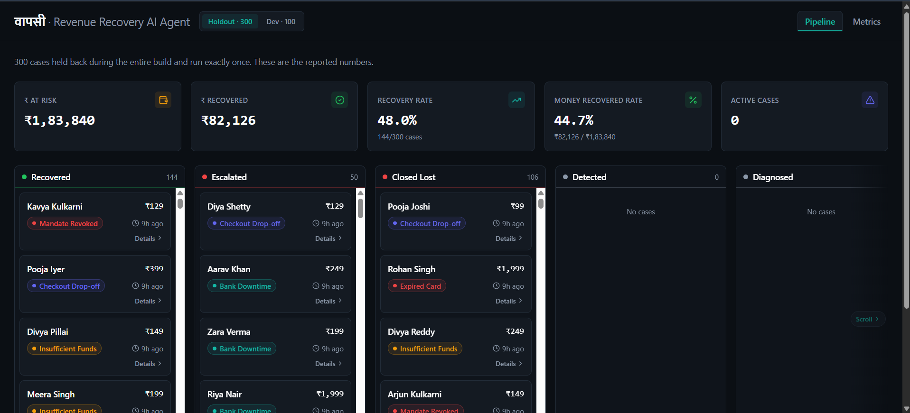
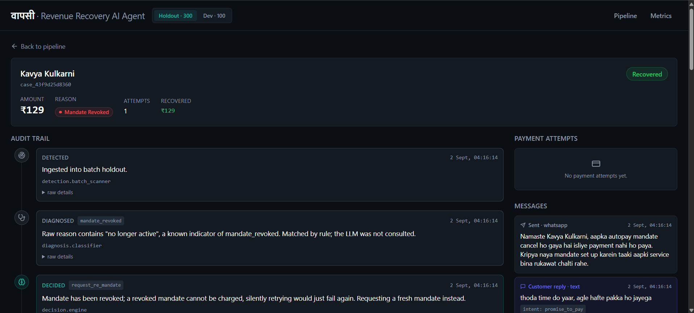
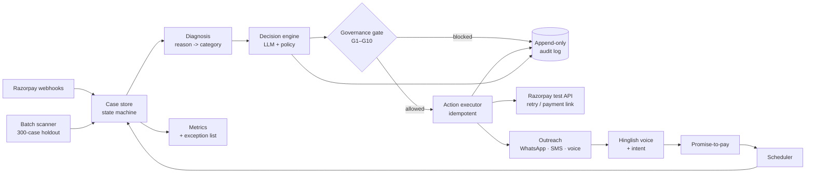

# वापसी · Wapsi

AI revenue recovery agent for Indian UPI AutoPay failures and checkout
drop-offs — it finds money slipping away, works out why, and wins it back,
with every action explainable, bounded, and logged.

### 48.0% recovered · +206.4% lift over the naive baseline · 0 double-charges

Measured on 300 held-out cases (seed `20260905`), run exactly once and never
tuned against.

Built for the **Razorpay AI Buildathon · Track 3 (AI Revenue Recovery)**.

**[Live dashboard](#)** *(deploying — Vercel URL to come)* · **[Demo video](#)** *(to come)* · **[Repository](https://github.com/PythonScript32/wapsi)**

---

## The problem

Revenue doesn't leave a business in one clean event — it leaks. A UPI AutoPay
renewal declines. A cart is abandoned at the payment screen. A customer says
"agle hafte kar dunga" and nobody follows up.

In India this is acute. UPI AutoPay debit failures run ~8–15% normally and
spiked to 55–90% across banks in Aug 2025, mostly from insufficient balance and
mandate issues. Most of those customers never chose to leave — that's
*involuntary churn*, and it's recoverable. Yet email-only dunning recovers under
10%, while WhatsApp plus a UPI link recovers roughly 3× more.

The gap between money lost and money recoverable — with the right timing, in the
right language — is what वापसी closed.

## What it did

- **Recurring-debit recovery** — caught failed subscription/AutoPay debits,
  diagnosed the reason, and retried *intelligently*: insufficient funds waited
  for salary day, bank downtime backed off, a revoked mandate was never
  silently charged.
- **Checkout drop-off recovery** — nudged abandoned checkouts, then made a
  bounded offer only if the nudge failed.
- **Hinglish voice concierge** — customers replied by voice note ("abhi paise
  nahi, agle hafte kar dunga") and the agent understood; reminders went out in
  Hinglish voice too.
- **Promise-to-pay tracking** — logged the promise, paused other outreach,
  scheduled the retry for that date, followed through, and reported a
  kept-promise rate.





## How it worked



Two sensors fed one brain, which worked through two layers, into one ledger.
The decision engine proposed an action; the governance gate authorised or
blocked it. Every decision — allowed or blocked — was written to the ledger
with its reasoning.

## Results

Measured on the **300-case held-out batch** (`data/cases_holdout.json`, seed
`20260905`). Run **exactly once**, after every other change in this repo was
finalized — these are the actual first-and-only numbers that run produced,
never re-run and never tuned against.

| Metric | Naive baseline | वापसी |
| --- | --- | --- |
| Recovery rate (count) | 15.7% | 48.0% |
| Recovery rate (value) | — | 44.7% |
| **Lift over baseline (count)** | — | **+206.4%** |
| Ceiling capture | — | 79.3% |
| Kept-promise rate | — | 32.1% (17/53) |
| Double-charges | — | **0** |

Full exception list (every unrecovered case, grouped by reason, with why) and
the four safety invariants (all `PASS`) are in `data/results_holdout.json`
(gitignored, generated locally) and rendered live on the dashboard's Metrics
screen.

### Dev vs holdout — do the numbers generalize?

The 100-case dev set (`data/cases_dev.json`, seed `42`) was used for all
tuning during the build. It's shown here for exactly one reason: to let you
check that the holdout numbers above aren't a fluke of one particular sample —
they land in the same range as dev, not off in some entirely different
direction, which is what you'd expect if the pipeline generalizes rather than
overfits.

| Metric | Dev (100 cases) | Holdout (300 cases) |
| --- | --- | --- |
| Recovery rate (count) | 50.0% | 48.0% |
| Recovery rate (value) | 42.9% | 44.7% |
| Lift over baseline (count) | +194.1% | +206.4% |
| Ceiling capture | 86.6% | 79.3% |
| Kept-promise rate | 27.3% (3/11) | 32.1% (17/53) |
| Double-charges | 0 | 0 |

Nothing here is cherry-picked: ceiling capture is the one metric that moves
more than a few points between the two sets (86.6% vs 79.3%), and it's
reported as-is rather than smoothed over, not investigated further here. Both
kept-promise rates rest on small denominators (11 and 53 resolved promises
respectively) — real numbers, not hidden behind a bare percentage, but not
something to over-read either.

## What's real vs simulated

**Real:**
- Razorpay test-mode API calls — real HTTP requests, real payment link IDs,
  real webhook payloads and signatures. Test mode means no money moves; it does
  not mean mocked.
- Postgres constraints doing real work — a UNIQUE idempotency key prevents
  double-charges at the database level; an append-only trigger rejects any
  attempt to alter the audit log.
- Hinglish transcription on real recorded audio.
- All decision logic: salary-day timing, reason-aware retries, governance gates.

**Simulated:**
- The population of 400 at-risk cases. No merchant has 300 real failed debits
  available for a two-week build, and the track asks for measured recovery
  across a batch. Reason distributions are modelled on published Indian UPI
  AutoPay failure data.
- Outreach delivery. Messages are composed and persisted exactly as they would
  be sent; the WhatsApp/SMS send is stubbed at the transport layer.
- Customer responses, drawn from a hidden ground-truth model the pipeline never
  reads. Only the outcome simulator sees it — the agent decides blind.

## Engineering highlights

- **Governance gate enforcing 10 bounds (G1–G10) at the authorising layer** —
  not advisory. On the holdout run alone it fired 220 promise-to-pay pauses
  (G10), 59 grace-period closes (G5), 44 per-reason attempt caps (G3), and 14
  permanent opt-outs (G2): counts pulled straight from the data, proving the
  gate actually binds rather than logging and letting everything through.
- **Append-only audit log enforced by a Postgres trigger** (`trg_audit_no_update`)
  — the database itself rejects any `UPDATE`/`DELETE` on `audit_log`, not just
  an application-layer convention.
- **Idempotency as a UNIQUE database constraint**, not application logic — a
  double-charge on the same payment attempt is structurally impossible, not
  merely checked for.
- **Four safety invariants computed from data, all zero**: double-charge
  incidents, post-opt-out contacts, actions without an audit row, over-cap
  discounts — every one `0` across 300 held-out cases.
- **497 tests passing.**
- **Held-out set run exactly once**, after every other change in this repo was
  finalized, and never tuned against.
- **Date-stability tests** — batch runs are driven by an injectable clock
  (`SimulatedClock`), never wall-clock time, so a run produces the same result
  whichever day it's executed.
- **Real Razorpay test-mode integration** — real HTTP calls, real payment link
  IDs, real webhook signature verification.
- **Hinglish voice tested on real recorded audio**, not synthetic text
  fixtures.

## Run it yourself

```bash
python3 -m venv .venv && source .venv/bin/activate && pip install -r requirements.txt
cp .env.example .env                       # add Razorpay + Supabase + Gemini keys
# run supabase/migrations/001_initial_schema.sql in the Supabase SQL Editor
python -m app.detection.synthetic_data     # writes the dev (100) + holdout (300) sets
uvicorn app.main:app --reload --port 8000  # backend
cd dashboard && npm install && npm run dev # dashboard -> :5173
```

Full walkthrough — accounts, installs, git, tooling — in [`SETUP.md`](SETUP.md).

## Built by

**Ekansh Chaurasiya**
[GitHub](https://github.com/PythonScript32/wapsi) ·
[LinkedIn](https://linkedin.com/in/ekanshchaurasiya) ·
[ekanshchaurasiya3@gmail.com](mailto:ekanshchaurasiya3@gmail.com)

---

*वापसी (wāpsī) — Hindi for "return". Getting the money back.*
